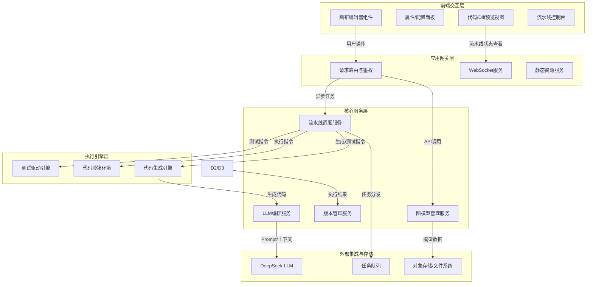

原始诉求：
uml类图设计工具：功能与架构设计
一：功能清单

1/UML类图编辑：添加/删除/移动类，备注，来凝结关系，支持全量的类关系（继承/组合/聚类/实现/关联/连接等）
2/类属性编辑：类名，构造型（interface/abstract等），抽象类标记，属性，方法
3/连接属性：多重性，角色名，连接备注
4/撤销/重做能力：最多五十步历史，支持操作合并（0.5内的同类操作合并）
5/画布缩放/平移：Ctrl+滚轮缩放，中键/空格平移，自适应当前窗口，重置缩放
6/网格对其：网格显示和隐藏，网格吸附，网格参数设置
7/文件操作：新建/打开/保存（.uml JSON格式）
8/设计文档导出：导出markdown格式设计文档
9/代码生成：调用LLM生成12种常见百年城语言代码，deepseek的apikey为sk-3b6b0eaa3b374234a8047e0c60844b24
10/LLM辅助UML优化：上传uml文件，LLM优化设计并生成diff对比
11/自动化流水线：七阶段流水线，UML优化-》开发确认-》代码生成-》用例检视-》测试用例代码增量生成-》用例调试-》基于用例反馈代码优化（最多三轮）
12/开发确认：版本对比面板，支持接收/拒绝优化结果，记录review日志
13/用例库检视：加载Excel用例库（例如testCase.xlsx）,用户标记变更用例
14/增量测试生成：基于变更用例，LLM增量生成测试代码
15/多框架测试代码执行：pytest/unittest/gtest/mvn,自动发现/执行/解析测试结果
16代码迭代优化：基于测试失败反馈，LLM修复代码（最多三轮）
17/大小调整：类四个角拖拽resize,备注右下角resize

# UML类图设计工具：功能与架构设计文档--技术拆解
## 1. 系统概述
本文档描述了一款基于LLM的智能化UML类图设计与代码生成自动化工具的系统架构与技术实现方案。该工具不仅提供完整的UML类图编辑功能，还深度集成DeepSeek大语言模型，实现从UML设计到代码生成、测试用例构建、代码优化的全流程自动化流水线。
### 1.1 核心价值
- **可视化建模**: 提供专业级UML类图编辑能力
- **智能辅助**: 利用LLM自动生成代码、优化设计、编写测试用例
- **自动化流水线**: 实现从设计到测试验证的闭环流程
- **多语言支持**: 支持12种主流编程语言的代码生成
### 1.2 功能范围
1. UML类图编辑与属性管理
2. 画布操作与图形交互
3. 文件操作与文档导出
4. LLM辅助设计与代码生成
5. 自动化开发流水线
6. 测试用例管理与执行
7. 代码迭代优化
---
## 2. 总体架构设计
### 2.1 架构分层
系统采用分层架构设计，共分为五层：
```
┌─────────────────────────────────────────────────────┐
│                   前端交互层                         │
├─────────────────────────────────────────────────────┤
│                   应用网关层                         │
├─────────────────────────────────────────────────────┤
│                   核心服务层                         │
├─────────────────────────────────────────────────────┤
│                   执行引擎层                         │
├─────────────────────────────────────────────────────┤
│                外部集成与存储层                      │
└─────────────────────────────────────────────────────┘
```
### 2.2 架构图

---
## 3. 技术栈选型
### 3.1 前端交互层
| 组件 | 技术选型 | 说明 |
|------|----------|------|
| 基础框架 | React 18+ / Vue 3 | 响应式框架，组件化开发 |
| 图形引擎 | **AntV X6** | 专业图编辑引擎，完美契合UML类图需求 |
| 状态管理 | Zustand / Redux Toolkit | 管理画布状态、UI面板状态 |
| 代码编辑器 | Monaco Editor | 用于显示生成代码和Diff对比 |
| UI组件库 | Ant Design / Element Plus | 企业级UI组件库 |
### 3.2 应用网关层
| 组件 | 技术选型 | 说明 |
|------|----------|------|
| Web框架 | **FastAPI** (Python) | 高性能异步框架，适合AI集成 |
| 路由控制 | Nginx / Traefik | 反向代理与负载均衡 |
| 实时通信 | WebSocket | 流水线进度实时推送 |
| API文档 | Swagger UI | 自动生成API文档 |
### 3.3 核心服务层
| 组件 | 技术选型 | 说明 |
|------|----------|------|
| 模型管理 | Python Business Logic | 处理UML JSON数据 |
| LLM编排 | **LangChain** | 封装DeepSeek API调用 |
| 流水线引擎 | **Celery + Redis** | 异步任务调度与编排 |
| 版本管理 | Diff-Match-Patch | 代码对比与变更管理 |
| 文档处理 | Pandas | 处理Excel用例库 |
### 3.4 执行引擎层
| 组件 | 技术选型 | 说明 |
|------|----------|------|
| 代码生成 | **Jinja2** | 模板引擎，生成多语言代码 |
| 沙箱环境 | **Docker** | 代码安全隔离执行 |
| 测试框架 | pytest / unittest / gtest | 多语言测试支持 |
| 进程管理 | subprocess | 命令行工具调用 |
### 3.5 外部集成与存储层
| 组件 | 技术选型 | 说明 |
|------|----------|------|
| LLM模型 | **DeepSeek API** | 兼容OpenAI SDK |
| 任务队列 | Redis | 消息队列与缓存 |
| 对象存储 | MinIO / S3 | 文件存储(UML文件、代码快照) |
| 结构化存储 | PostgreSQL | 项目元数据、用户信息 |
| 文档存储 | MongoDB | UML图JSON数据、日志记录 |
---
## 4. 核心功能实现映射
### 4.1 画布编辑功能 (功能1-6, 17)
| 功能点 | 技术实现 | 关键特性 |
|--------|----------|----------|
| 类图编辑 | AntV X6 Graph | 节点/连线管理 |
| 属性编辑 | React Form + Zustand | 双向绑定 |
| 连接属性 | AntV X6 Edge | 多重性、角色名配置 |
| 撤销/重做 | AntV X6 History Plugin | 最多50步，操作合并 |
| 画布操作 | AntV X6 Transform | 缩放、平移、自适应 |
| 网格系统 | AntV X6 Grid Plugin | 吸附、显示/隐藏、参数设置 |
| 大小调整 | AntV X6 Resizer | 四角拖拽、右下角拖拽 |
### 4.2 文件操作与导出 (功能7-8)
| 功能点 | 技术实现 | 说明 |
|--------|----------|------|
| 文件操作 | Node.js/Python 文件IO | 新建、打开、保存(UML JSON) |
| 文档导出 | Markdown-it | 设计文档生成 |
### 4.3 LLM集成功能 (功能9-10)
| 功能点 | 技术实现 | 说明 |
|--------|----------|------|
| 代码生成 | Jinja2模板 + LLM | 12种语言骨架生成 |
| UML优化 | DeepSeek API + Context | 上传UML，生成优化建议 |
### 4.4 自动化流水线 (功能11-16)
| 功能点 | 技术实现 | 说明 |
|--------|----------|------|
| 流水线调度 | Celery Chain | 七阶段流程编排 |
| 开发确认 | Diff-Match-Patch + React Diff Viewer | 版本对比、接收/拒绝 |
| 用例管理 | Pandas | Excel用例库解析 |
| 测试生成 | LLM服务 + 代码生成引擎 | 增量测试代码生成 |
| 测试执行 | Docker容器 | 多框架测试自动发现/执行 |
| 代码优化 | 反馈循环机制 | 基于测试失败自动修复(最多3轮) |
---
## 5. 数据模型设计
### 5.1 UML类模型
```json
{
  "id": "string",
  "name": "string",
  "stereotype": "class|interface|abstract",
  "attributes": [
    {
      "name": "string",
      "type": "string",
      "visibility": "+|-|#"
    }
  ],
  "methods": [
    {
      "name": "string",
      "returnType": "string",
      "params": "string",
      "visibility": "+|-|#"
    }
  ],
  "position": { "x": number, "y": number },
  "size": { "width": number, "height": number }
}
```
### 5.2 连接模型
```json
{
  "id": "string",
  "source": "string",
  "target": "string",
  "type": "inheritance|composition|aggregation|association|realization",
  "multiplicity": "string",
  "roleName": "string",
  "note": "string"
}
```
### 5.3 流水线状态模型
```json
{
  "pipelineId": "string",
  "currentStage": "string",
  "stages": [
    {
      "name": "string",
      "status": "pending|running|success|failed",
      "result": "object",
      "logs": "string"
    }
  ],
  "codeArtifacts": [
    {
      "language": "string",
      "content": "string",
      "version": "string"
    }
  ]
}
```
---
## 6. 部署架构建议
### 6.1 开发环境
- **前端**: React开发服务器 (http://localhost:3000)
- **后端**: FastAPI Uvicorn服务器 (http://localhost:8000)
- **数据库**: 本地Docker容器
- **消息队列**: 本地Redis服务器
### 6.2 生产环境
```
┌─────────────┐
│   Nginx LB  │
└──────┬──────┘
       │
   ┌───┴────┐
   │ Docker │
   │ Swarm  │
   └───┬────┘
       │
   ┌───┼────┬────┬────┐
   │   │    │    │    │
┌──┴─┐┌┴──┐ ┌┴──┐ ┌┴──┐┌─────┐
│Web ││API│ │Cel│ │Redis│DB  │
│UI  ││Svc│ │ery│ │     │    │
└────┘└───┘ └───┘ └────┘└─────┘
```
### 6.3 扩展性设计
- **微服务**: 可将核心服务拆分为独立微服务
- **容器编排**: 支持Kubernetes部署
- **分布式存储**: 大文件存储支持Ceph/S3
- **负载均衡**: 支持多实例部署
---
## 7. 安全与性能考虑
### 7.1 安全措施
- **代码沙箱**: Docker容器隔离执行用户代码
- **API鉴权**: JWT Token认证
- **输入验证**: 严格的参数校验和XSS防护
- **文件安全**: 严格的文件类型和大小限制
### 7.2 性能优化
- **前端优化**: 代码分割、懒加载、虚拟滚动
- **后端优化**: 异步处理、缓存策略、数据库索引
- **LLM优化**: 上下文管理、请求批处理、结果缓存
- **网络优化**: CDN加速、WebSocket长连接
---

---
## 9. 总结
本技术架构方案采用现代化技术栈，通过分层设计实现了高内聚低耦合的系统架构。前端采用AntV X6提供专业的图形编辑体验，后端基于FastAPI和Celery构建高性能异步处理能力，深度集成DeepSeek LLM实现智能化辅助开发。
核心亮点：
1. **专业级图形编辑**: 基于AntV X6的完整UML编辑能力
2. **AI深度集成**: 从设计到优化的全流程AI辅助
3. **自动化闭环**: 七阶段流水线实现开发测试一体化
4. **安全隔离**: Docker沙箱确保代码执行安全
5. **扩展性**: 微服务架构支持未来功能扩展
该架构方案能够满足当前所有功能需求，并为后续功能扩展预留了充分空间。
